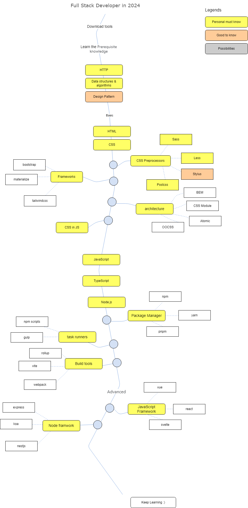

# Web Developer Roadmap

English &nbsp; | &nbsp; [Chinese](./README.zh-CN.md)

> Roadmap to becoming a web developer in 2024.

Below you can find a chart demonstrating the paths that you can take and the libraries that you would want to learn to become a Web developer. I made this chart as a tip for everyone who asks me, "What should I learn next as a Web developer?"

## Disclaimer

> The purpose of this roadmap is to give you an idea about the landscape. The road map will guide you if you are confused about what to learn next, rather than encouraging you to pick what is hype and trendy. You should grow some understanding of why one tool would be better suited for some cases than the other and remember that hype and trendy do not always mean best suited for the job.

## Roadmap

## Resources

1. Download Tools
   
   - [sublime text](https://www.sublimetext.com/)
   - [visual studio code](https://code.visualstudio.com/)
   - [webstorm](https://www.jetbrains.com/webstorm/)
   - [git](https://git-scm.com/)
   - [chrome]()

2. Prerequisite knowledge
  
   - [HTTP]()
   - [datastruct & algorithm]()
   - [design pattern]()
  
3. Basic
   
   - [html]()
   - [css]()
     
     - preprocessor: [less]()、[sass]()、[stylus]() & [postcss]()
     - frameworks: [bootstrap]()、[materialize]() & [tailwindcss]()
     - architecture: [BEM]()、[CSS Modules]()、[Atomic]() & [OOCSS]()
     - css in js: [styled-components]() & [emotion]()

   - [javascript]()
   - [typescript]()
   - [node]()
  
     - package managers: [npm]()、[yarn]() & [pnpm]()
     - task runners: [npm scripts]() & [gulp]()
     - build tools: [webpack]()、[rollup]() & [vite]()

4. Advanced

   - frontend frameworks

     - [vue]()
       
       - state management: [vuex]() & [pinia]() 

     - [react]()
       
       - state management: [redux]() & [mobx]()

   - backend frameworks

     - [express]()
     - [koa]()

   - testing

     - unit testing
       
       - [jest]()
       - [mocha]()
       - [vitest]()
     
     - end-to-end testing
       
       - [cypress]()
       - [puppeteer]()
       - [playwright]()

   - cross-terminal
     
     - desktop: [electron]() 

5. Utility Libraries

6. General Development Skills

   - Use google Search.
   - Get familiar with terminal, configure your shell (bash, zsh, fish).

## Contribution

## License

